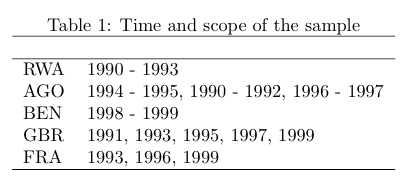
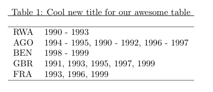
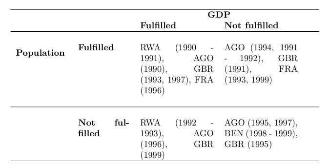

<!-- README.md is generated from README.Rmd. Please edit that file -->

# overviewR 

<!-- badges: start -->

[](https://travis-ci.com/cosimameyer/overviewR)
[](https://www.gnu.org/licenses/gpl-3.0)
[](/commits/master)
[](https://codecov.io/gh/cosimameyer/overviewR?branch=master)
[](https://www.repostatus.org/#active)
<!-- [](https://www.tidyverse.org/lifecycle/#maturing) -->
<!-- badges: end -->

The goal of overviewR is to make it easy to get an overview of your data
by displaying relevant sample information. At the moment, you have two
functions (`overview_tab` and `overview_crosstab`) that allow you to
generate a tabular overview of both your general sample and conditional
sample. The general sample plots a two-column table that gives
information on your id in the left column and on the time frame for the
respective id in the right column. The conditional column further plots
a cross table on two conditions. This way, you can easily visualize your
theoretical assumptions with examples from your dataset. The function
`overview_print` then converts this output to nicely usable TeX code.

The output of this package is also compatible with other packages such
as [`xtable`](https://cran.r-project.org/web/packages/xtable/xtable.pdf)
and
[`flextable`](https://cran.r-project.org/web/packages/flextable/vignettes/overview.html).

## Installation

You can install the latest version of `overviewR` directly from
[GitHub](https://github.com/cosimameyer/overviewR) with:

``` r
library(devtools)
devtools::install_github("cosimameyer/overviewR")
```

<!--[CRAN](https://CRAN.R-project.org) with:
``` r
install.packages("overviewR")
```
-->

## Example

In a first step, we load the package.

``` r
library(overviewR)
```

For the examples, we will use the pre-loaded toy data of the package.
The package comes with two cross-sectional datasets on a
country-month-year unit (`data`) as well as on a testperson-date unit
(`day_data`). Before we get started, we load the data and have a look at
the data first.

``` r
data(toydata)
head(toydata)
#>   ccode year month      gdp population
#> 1   RWA 1990   Jan 24180.77  14969.988
#> 2   RWA 1990   Feb 23650.53  11791.464
#> 3   RWA 1990   Mar 21860.14  30047.979
#> 4   RWA 1990   Apr 20801.06  19853.556
#> 5   RWA 1990   May 18702.84   5148.118
#> 6   RWA 1990   Jun 30272.37  48625.140
```

<!-- ``` -->

<!--     ccode   year   month  gdp       population -->

<!--     RWA     1990   Jan    24180.77  14969.988 -->

<!--     RWA     1990   Feb    23650.53  11791.464 -->

<!--     RWA     1990   Mar    21860.14  30047.979 -->

<!--     RWA     1990   Apr    20801.06  19853.556 -->

<!--     RWA     1990   May    18702.84   5148.118 -->

<!--     RWA     1990   Jun    30272.37  48625.140 -->

<!-- ``` -->

We have 264 observations for 5 countries (Angola, Benin, France, Rwanda,
and UK) stored in the `ccode` variable, over a time period between 1990
to 1999 (`year`). We also have additional information for the month
(`month`). As you can tell, we have some gaps in the time frame. We also
add randomly generated values for the GDP (`gdp`) and the population
size (`population`).

As you can see, we need a data frame that has one column with an id (in
this case `ccode` which stands for countries or `testperson` which
stands for the identifier of the test person) and one column with a time
variable (here `years`, `month`, or `date`). If your data set does not
have this format, consider using [`pivot_wider()` or
`pivot_longer()`](https://tidyr.tidyverse.org/reference/pivot_longer.html)
to get to the format.

### `overview_tab`

Generate some general overview using `overview_tab`.

``` r
output_table <- overview_tab(dat = toydata, id = ccode, time = year)
```

Checking the output, we get a tibble like this:

``` r
output_table
```

    # ccode   time_frame
    # RWA       1990 - 1995
    # AGO       1990 - 1992
    # BEN       1995 - 1999
    # GBR       1991, 1993, 1995, 1997, 1999
    # FRA       1993, 1996, 1999

We store the output in the object `output_table` to access it later.
<!-- This function automatically generates an object and stores it in your environment so that you can access it later. -->

### `overview_crosstab`

If you want to generate a cross table that divides our data
conditionally on two factors, this can be done with `overview_crosstab`.

``` r
output_crosstab <- overview_crosstab(
    dat = toydata,
    cond1 = gdp,
    cond2 = population,
    threshold1 = 25000,
    threshold2 = 27000,
    id = ccode,
    time = year
  )
```

Checking the output, we get a data frame like this:

    #   part1                                      part2
    # 1 AGO (1990, 1992), FRA (1993), GBR (1997)   BEN (1996, 1999), FRA (1999), GBR (1993), RWA (1992, 1994)
    # 2 BEN (1997), RWA (1990)                     AGO (1991), BEN (1995, 1998), FRA (1996), GBR (1991, 1995, 1999), RWA (1991, 1993, 1995)

Note, if you use a data set that has multiple observations on your
id-time unit, the function automatically aggregates your data frame
using the mean of your condition 1 and your condition 2.

We also store the output in the object, this time in `output_crosstab`,
to access it later.

<!-- The resulting data frame is again stored as an object in your environment so that you can access it later. -->

### `overview_print`

To generate an easily usable LaTeX output, `overviewR` offers the
function `overview_print`.

We will start with our general sample overview, stored in
`output_table`.

``` r
overview_print(obj = output_table)
```

<details>

<summary>TeX output</summary>

``` r
overview_print(obj = output_table)
```

    % Overview table generated in R version 4.0.0 (2020-04-24) using overviewR
     \begin{table}[ht]
     \centering
     \caption{Time and scope of the sample}
     \begin{tabular}{ll}
     \hline
    Sample & Time frame \\ \hline
     RWA & 1990 - 1995 \\ AGO & 1990 - 1992 \\ BEN & 1995 - 1999 \\ GBR & 1991, 1993, 1995, 1997, 1999 \\ FRA & 1993, 1996, 1999 \\ \hline
     \end{tabular}
     \end{table}

</details>

<p align="center">



</p>

The default already gives us a nice title (“Time and scope of the
sample”) but can be modified in the argument `title = ...`. The same
holds for the column names (“Sample” and “Time frame” by default).

``` r
overview_print(obj = output_table, id = "Countries", time = "Years", title = "Cool new title for our awesome table")
```

<details>

<summary>TeX output</summary>

``` r
overview_print(obj = output_table, id = "Countries", time = "Years", title = "Cool new title for our awesome table")
```

    % Overview table generated in R version 4.0.0 (2020-04-24) using overviewR
     \begin{table}[ht]
     \centering
     \caption{Cool new title for our awesome table}
     \begin{tabular}{ll}
     \hline
    Countries & Years \\ \hline
     RWA & 1990 - 1995 \\ AGO & 1990 - 1992 \\ BEN & 1995 - 1999 \\ GBR & 1991, 1993, 1995, 1997, 1999 \\ FRA & 1993, 1996, 1999 \\ \hline
     \end{tabular}
     \end{table}

</details>

<p align="center">



</p>

The same function also text formatted cross tables, using the argument
`crosstab = TRUE`. We will do this by using the object `output_crosstab`
that was stored from our cross table above. There are also options to
label the respective conditions (`cond1` and `cond2`) as you can see in
the example.

``` r
overview_print(
  obj = output_crosstab,
  title = "Cross table of the sample",
  crosstab = TRUE,
  cond1 = "GDP",
  cond2 = "Population"
)
```

<details>

<summary>TeX output</summary>

``` r
overview_print(
  obj = output_crosstab,
  title = "Cross table of the sample",
  crosstab = TRUE,
  cond1 = "GDP",
  cond2 = "Population"
)
```

    % Overview table generated in R version 3.6.3 (2020-02-29) using overviewR
     % Please add the following required packages to your document preamble:
     % \usepackage{multirow}
     % \usepackage{tabularx}
     % \newcolumntype{b}{X}
     % \newcolumntype{s}{>{\hsize=.5\hsize}X}
    
     \begin{table}[]
     \begin{tabularx}{\textwidth}{ssbb}
     \hline & &
     \multicolumn{2}{c}{\textbf{GDP}} \\  & & \textbf{Fulfilled} &
     \textbf{Not fulfilled} \\ \hline \\ \multirow{2}{*}{\textbf{Population}} & \textbf{Fulfilled} &
     RWA (1990 - 1991), AGO (1990), GBR (1993, 1997), FRA (1996) & AGO (1994, 1991 - 1992), GBR (1991), FRA (1993, 1999)\\  \\ \hline \\ & \textbf{Not fulfilled} &  RWA (1992 - 1993), AGO (1996), GBR (1999) & AGO (1995, 1997), BEN (1998 - 1999), GBR (1995)\\  \hline \\ \end{tabularx}
     \end{table}

</details>

<p align="center">



</p>

With `save_out = TRUE` you can also export both outputs as `.tex` files
and store them on your device.

``` r
overview_print(obj = output_table, save_out = TRUE)
```

## Compatabilities with other packages

The output is also compatible with other functions such as
[`xtable`](https://cran.r-project.org/web/packages/xtable/xtable.pdf) or
[`flextable`](https://cran.r-project.org/web/packages/flextable/vignettes/overview.html).

One example is shown below:

``` r
# install.packages("flextable")
library(flextable)
table_output <- qflextable(output_table)
table_output <-
  set_header_labels(table_output,   
                    ccode = "Countries",
                    time_frame = "Time frame")
set_table_properties(
  table_output,
  width = .4,
  layout = "autofit"
)
```

# Credits

This package is built by [Cosima Meyer](https://cosimameyer.github.io)
and [Dennis Hammerschmidt](http://dennis-hammerschmidt.rbind.io).

The hex sticker is generated by ourselves using the
[`hexSticker`](https://github.com/GuangchuangYu/hexSticker) package.
