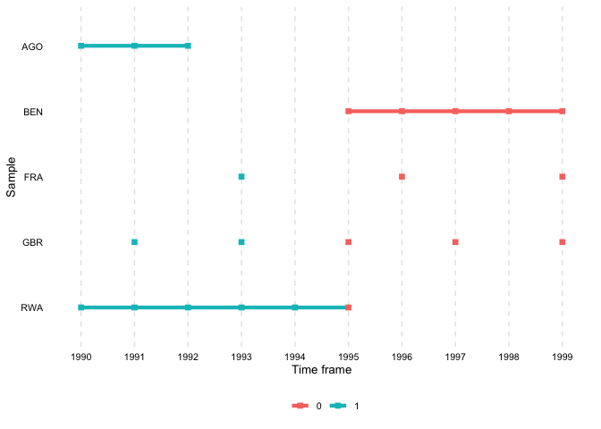
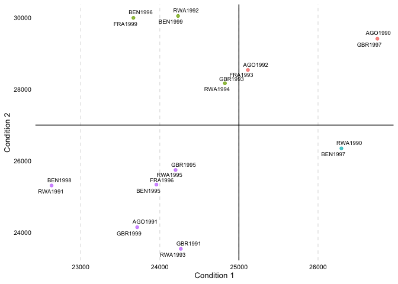
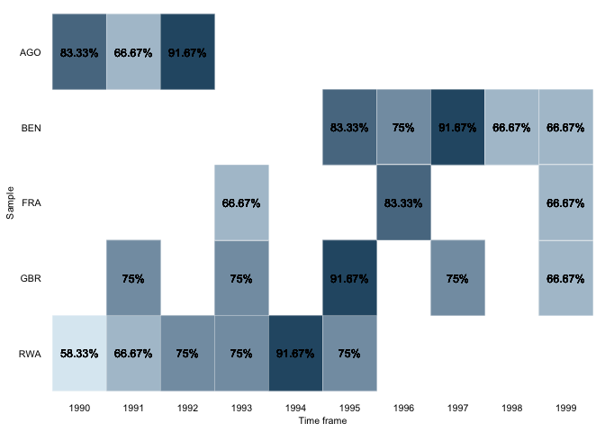
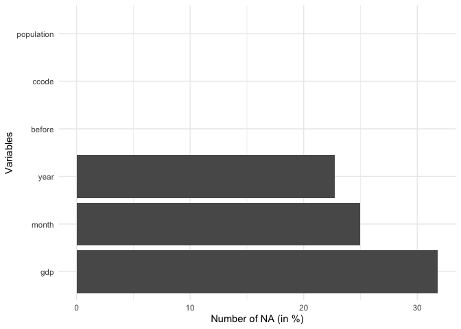

# overviewR 

<!-- badges: start -->

[](https://github.com/cosimameyer/overviewR/actions)
[](https://codecov.io/gh/cosimameyer/overviewR?branch=master)
[](https://www.repostatus.org/#active)
[](https://github.com/cosimameyer/overviewR)
[](https://github.com/cosimameyer/overviewR)
<!--[](https://www.r-pkg.org/badges/version/overviewR)-->
[](https://www.r-pkg.org/badges/version/overviewR)
[](https://cran.r-project.org/package=overviewR)
[](https://zenodo.org/badge/latestdoi/269955026)
[](https://www.gnu.org/licenses/gpl-3.0.en.html)
<!-- [](https://www.rdocumentation.org/packages/overviewR) -->
<!-- [](https://cran.r-project.org/package=overviewR) -->
<!-- [](https://cran.r-project.org/web/checks/check_results_overviewR.html) -->
<!-- [](https://www.r-pkg.org/badges/version/overviewR) -->
<!-- [](https://www.gnu.org/licenses/gpl-3.0) -->
<!-- [](/commits/master) -->
<!-- badges: end -->

[**You can access the CheatSheet for overviewR
here**](https://github.com/cosimameyer/overviewR/blob/master/man/figures/CheatSheet_overviewR.pdf)

The goal of overviewR is to make it easy to get an overview of a data
set by displaying relevant sample information. At the moment, there are
the following functions:

-   `overview_tab` generates a tabular overview of the sample. The
    general sample plots a two-column table that provides information on
    an id in the left column and a the time frame on the right column.
-   `overview_crosstab` generates a cross table. The conditional column
    allows to disaggregate the overview table by specifying two
    conditions, hence resulting a 2x2 table. This way, it is easy to
    visualize the time and scope conditions as well as theoretical
    assumptions with examples from the data set.
-   `overview_print` converts the output of both `overview_tab` and
    `overview_crosstab` into LaTeX code and/or directly into a .tex
    file.
-   `overview_plot` is an alternative to visualize the sample (a way to
    present results from `overview_tab`)
-   `overview_crossplot` is an alternative to visualize a cross table (a
    way to present results from `overview_crosstab`)
-   `overview_heat` plots a heat map of your time line
-   `overview_na` plots an overview of missing values by variable
-   `overview_overlap` plots comparison plots (bar graph and Venn
    diagram) to compare to data frames

The plots can be saved using the `ggsave()` command. The output of
`overview_tab` and `overview_crosstab` are also compatible with other
packages such as [`xtable`](https://CRAN.R-project.org/package=xtable),
[`flextable`](https://CRAN.R-project.org/package=flextable), or
[`knitr`](https://bookdown.org/yihui/rmarkdown-cookbook/kable.html).

We present a short step-by-step guide as well as the functions in more
detail below.

## Installation

A stable version of `overviewR` can be directly accessed on CRAN:

``` r
install.packages("overviewR", force = TRUE)
```

To install the latest development version of `overviewR` directly from
[GitHub](https://github.com/cosimameyer/overviewR) use:

``` r
library(devtools) # Tools to Make Developing R Packages Easier # Tools to Make Developing R Packages Easier
devtools::install_github("cosimameyer/overviewR")
```

## Example

First, load the package.

``` r
library(overviewR) # Easily Extracting Information About Your Data # Easily Extracting Information About Your Data
```

The following examples use a toy data set (`toydata`) that comes with
the package. This data contains artificially generated information in a
cross-sectional format on 5 countries, covering the period 1990-1999.

``` r
data(toydata)
head(toydata)
#>   ccode year month      gdp population
#> 1   RWA 1990   Jan 24180.77  14969.988
#> 2   RWA 1990   Feb 23650.53  11791.464
#> 3   RWA 1990   Mar 21860.14  30047.979
#> 4   RWA 1990   Apr 20801.06  19853.556
#> 5   RWA 1990   May 18702.84   5148.118
#> 6   RWA 1990   Jun 30272.37  48625.140
```

<!-- ``` -->
<!--     ccode   year   month  gdp       population -->
<!--     RWA     1990   Jan    24180.77  14969.988 -->
<!--     RWA     1990   Feb    23650.53  11791.464 -->
<!--     RWA     1990   Mar    21860.14  30047.979 -->
<!--     RWA     1990   Apr    20801.06  19853.556 -->
<!--     RWA     1990   May    18702.84   5148.118 -->
<!--     RWA     1990   Jun    30272.37  48625.140 -->
<!-- ``` -->

There are 264 observations for 5 countries (Angola, Benin, France,
Rwanda, and UK) stored in the `ccode` variable, over a time period
between 1990 to 1999 (`year`) with additional information for the month
(`month`). Additionally, two artificially generated fake variables for
GDP (`gdp`) and population size (`population`) are included to
illustrate of conditions.

The following functions work best on data sets that have an
id-time-structure, in the case of `toydata` this corresponds to
country-year with `ccode` and `year`. If the data set does not have this
format yet, consider using [`pivot_wider()` or
`pivot_longer()`](https://tidyr.tidyverse.org/reference/pivot_longer.html)
to get to the format.

### `overview_tab`

Generate some general overview of the data set using the time and scope
conditions with `overview_tab`.

``` r
output_table <- overview_tab(dat = toydata, id = ccode, time = year)
```

The resulting data frame collapses the time condition for each id by
taking into account potential gaps in the time frame. Note that the
column name for the time frame is set by default to `time_frame` and
internally generated when using `overview_tab`.

``` r
output_table
```

    # ccode   time_frame
    # RWA       1990 - 1995
    # AGO       1990 - 1992
    # BEN       1995 - 1999
    # GBR       1991, 1993, 1995, 1997, 1999
    # FRA       1993, 1996, 1999

### `overview_crosstab`

To generate a cross table that divides the data based on two conditions,
for instance GDP and population size, `overview_crosstab` can be used.
`threshold1` and `threshold2` thereby indicate the cut point for the two
conditions (`cond1` and `cond2`), respectively.

``` r
output_crosstab <- overview_crosstab(
    dat = toydata,
    cond1 = gdp,
    cond2 = population,
    threshold1 = 25000,
    threshold2 = 27000,
    id = ccode,
    time = year
  )
```

The data frame output looks as follows:

    #   part1                                      part2
    # 1 AGO (1990, 1992), FRA (1993), GBR (1997)   BEN (1996, 1999), FRA (1999), GBR (1993), RWA (1992, 1994)
    # 2 BEN (1997), RWA (1990)                     AGO (1991), BEN (1995, 1998), FRA (1996), GBR (1991, 1995, 1999), RWA (1991, 1993, 1995)

Note, if a data set is used that has multiple observations on the
id-time unit, the function automatically aggregates the data set using
the mean of condition 1 (`cond1`) and condition 2 (`cond2`).

### `overview_print`

To generate an easily usable LaTeX output for the generated
`overview_tab` and `overview_crosstab` objects, `overviewR` offers the
function `overview_print`. The following illustrate this using the
`output_table` object from `overview_tab`.

``` r
overview_print(obj = output_table)
```

<details>
<summary>
LaTeX output
</summary>

    % Overview table generated in R version 4.0.0 (2020-04-24) using overviewR 
    % Table created on 2020-06-21
    \begin{table}[ht] 
     \centering 
     \caption{Time and scope of the sample} 
     \begin{tabular}{ll} 
     \hline 
    Sample & Time frame \\ 
    \hline 
     RWA & 1990 - 1995 \\ 
     AGO & 1990 - 1992 \\ 
     BEN & 1995 - 1999 \\ 
     GBR & 1991, 1993, 1995, 1997, 1999 \\ 
     FRA & 1993, 1996, 1999 \\ 
     \hline 
     \end{tabular} 
     \end{table}

</details>
<p align="center">

</p>

The default already provides a title (“Time and scope of the sample”)
that can be modified in the argument `title`. The same holds for the
column names (“Sample” and “Time frame” are set by default but can be
modified as shown below).

``` r
overview_print(obj = output_table, id = "Countries", time = "Years",
               title = "Cool new title for our awesome table")
```

<details>
<summary>
LaTeX output
</summary>

    % Overview table generated in R version 4.0.0 (2020-04-24) using overviewR 
    % Table created on 2020-06-21
    \begin{table}[ht] 
     \centering 
     \caption{Cool new title for our awesome table} 
     \begin{tabular}{ll} 
     \hline 
    Countries & Years \\ 
    \hline 
     RWA & 1990 - 1995 \\ 
     AGO & 1990 - 1992 \\ 
     BEN & 1995 - 1999 \\ 
     GBR & 1991, 1993, 1995, 1997, 1999 \\ 
     FRA & 1993, 1996, 1999 \\ 
     \hline 
     \end{tabular} 
     \end{table} 

</details>
<p align="center">

</p>

The same function can also be used for outputs from the
`overview_crosstab` function by using the argument `crosstab = TRUE`.
There are also options to label the respective conditions (`cond1` and
`cond2`). Note that this should correspond to the conditions (`cond1`
and `cond2`) specified in the `overview_crosstab` function.

``` r
overview_print(
  obj = output_crosstab,
  title = "Cross table of the sample",
  crosstab = TRUE,
  cond1 = "GDP",
  cond2 = "Population"
)
```

<details>
<summary>
LaTeX output
</summary>

    % Overview table generated in R version 4.0.0 (2020-04-24) using overviewR 
    % Table created on 2020-06-21
    % Please add the following packages to your document preamble: 
    % \usepackage{multirow} 
    % \usepackage{tabularx} 
    % \newcolumntype{b}{X} 
    % \newcolumntype{s}{>{\hsize=.5\hsize}X} 
    \begin{table}[ht] 
    \caption{Cross table of the sample} 
     \begin{tabularx}{\textwidth}{ssbb} 
    \hline & & \multicolumn{2}{c}{\textbf{GDP}} \\ 
     & & \textbf{Fulfilled} & \textbf{Not fulfilled} \\ 
     \hline \\ 
     \multirow{2}{*}{\textbf{Population}} & \textbf{Fulfilled} & 
     AGO (1990, 1992), FRA (1993), GBR (1997) & BEN (1996, 1999), FRA (1999), GBR (1993), RWA (1992, 1994)\\  
     \\ \hline \\ 
     & \textbf{Not fulfilled} &  BEN (1997), RWA (1990) & AGO (1991), BEN (1995, 1998), FRA (1996), GBR (1991, 1995, 1999), RWA (1991, 1993, 1995)\\  \hline \\ 
     \end{tabularx} 
     \end{table} 

</details>
<p align="center">

</p>

`overview_print` further allows more specifications such as the font
size or a a label. *These functions are currently supported only in the
development version of the package.*

``` r
overview_print(obj = output_table,
               fontsize = "scriptsize",
               label = "tab:overview")
```

With `save_out = TRUE` the function exports the output as a `.tex` file
and stores it on the device.

``` r
overview_print(obj = output_table, save_out = TRUE, path = "SET-YOUR-PATH",
               file = "output.tex")
```

### `overview_plot`

In addition to tables, `overviewR` also provides plots to illustrate the
structure of your data. `overview_plot` illustrates the information that
is generated in `overview_table` in a ggplot graphic. All scope objects
(e.g., countries) are listed on the y-axis where horizontal lines
indicate the coverage across the entire time frame of the data (x-axis).
This helps to spot gaps in the data for specific scope objects and
outlines at what time point they occur.

``` r
data(toydata)
overview_plot(dat = toydata, id = ccode, time = year)
```


The results are sorted alphabetically by default. The order can also be
reversed by setting `asc` to `FALSE`.

``` r
overview_plot(dat = toydata, id = ccode, time = year, asc = FALSE)
```


There is also an option to color the time lines conditionally. Here, we
introduce a dummy variable that indicates whether the year was before
1995 or not. We use this dummy to color the time lines using the `color`
argument. *Note, this argument is currently only implemented in the
development version that can be accessed from GitHub.*

``` r
# Load the GitHub version
library(devtools) # Tools to Make Developing R Packages Easier
devtools::install_github("cosimameyer/overviewR")
#> 
#>      checking for file ‘/private/var/folders/23/l11m8s8s42x85pmh6100kf180000gn/T/Rtmpn9zPqU/remotesbc8c1543222f/cosimameyer-overviewR-c07706e/DESCRIPTION’ ...  ✓  checking for file ‘/private/var/folders/23/l11m8s8s42x85pmh6100kf180000gn/T/Rtmpn9zPqU/remotesbc8c1543222f/cosimameyer-overviewR-c07706e/DESCRIPTION’
#>   ─  preparing ‘overviewR’:
#>      checking DESCRIPTION meta-information ...  ✓  checking DESCRIPTION meta-information
#>   ─  checking for LF line-endings in source and make files and shell scripts
#>   ─  checking for empty or unneeded directories
#>   ─  building ‘overviewR_0.0.7.999.1.tar.gz’
#>      
#> 
library(overviewR) # Easily Extracting Information About Your Data
library(magrittr) # A Forward-Pipe Operator for R

# Code whether a year was before 1995
toydata %<>%
  dplyr::mutate(before = ifelse(year < 1995, 1, 0))

# Plot using the `color` argument
overview_plot(dat = toydata, id = ccode, time = year, color = before)
```


The development version also allows to change the dot size using the
`dot_size` argument. The default is “2”. *Note, this argument is
currently only implemented in the development version that can be
accessed from GitHub.*

``` r
# Plot using the `color` argument
overview_plot(dat = toydata, id = ccode, time = year, dot_size = 5)
```

<p align="center">

</p>

### `overview_crossplot`

To visualize also the cross table, `overview_crossplot` does the job.
*Note, this function is currently only implemented in the development
version that can be accessed from GitHub.*

``` r
# Load the GitHub version
library(devtools) # Tools to Make Developing R Packages Easier
devtools::install_github("cosimameyer/overviewR")
library(overviewR) # Easily Extracting Information About Your Data

overview_crossplot(
  toydata,
  id = ccode,
  time = year,
  cond1 = gdp,
  cond2 = population,
  threshold1 = 25000,
  threshold2 = 27000,
  color = TRUE,
  label = TRUE
)
```



### `overview_heat`

`overview_heat` takes a closer look at the time and scope conditions by
visualizing the data coverage for each time and scope combination in a
ggplot heat map. This function is best explained using an example.
Suppose you have a dataset with monthly data for different countries and
want to know if data is available for each country in every month.
`overview_heat` intuitively does this by plotting a heat map where each
cell indicates the coverage for that specific combination of time and
scope (e,g., country-year). As illustrated below, the darker the cell
is, the more coverage it has. The plot also indicates the relative or
absolute coverage of each cell. For instance, Angola (“AGO”) in 1991
shows the coverage of 75%. This means that of all potential 12 months of
coverage (12 months for one year), only 9 are covered.

``` r
overview_heat(toydata_red,
                ccode,
                year,
                perc = TRUE,
                exp_total = 12)
```



### `overview_na`

`overview_na` is a simple function that provides information about the
content of all variables in your data, not only the time and scope
conditions. It returns a horizontal ggplot bar plot that indicates the
amount of missing data (NAs) for each variable (on the y-axis). You can
choose whether to display the relative amount of NAs for each variable
in percentage (the default) or the total number of NAs.

``` r
overview_na(toydata_with_na)
```



``` r
overview_na(toydata_with_na, perc = FALSE)
```


### `overview_overlap`

This function allows to compare two data sets. We are currently working
on an extended version that allows comparing &gt;2 data sets. *Note,
this function is currently only implemented in the development version
that can be accessed from GitHub.*

At the current development stage, the function works as follows:

``` r
library(dplyr)

# Subset one data set for comparison
toydata2 <- toydata %>% dplyr::filter(year > 1992)

overview_overlap(
  dat1 = toydata,
  dat2 = toydata2,
  dat1_id = ccode,
  dat2_id = ccode,
  plot_type = "bar" # This is the default
)
```

<p align="center">

</p>

Or a Venn diagram

``` r
overview_overlap(
  dat1 = toydata,
  dat2 = toydata2,
  dat1_id = ccode,
  dat2_id = ccode,
  plot_type = "venn"
)
```

<p align="center">

</p>

## Compatibilities with other packages

### Presenting tables: `flextable`, `xtable`, and `kable`

The outputs of `overview_tab` and `overview_crosstab` are also
compatible with other functions such as
[`xtable`](https://CRAN.R-project.org/package=xtable),
[`flextable`](https://CRAN.R-project.org/package=flextable), or
[`kable`](https://bookdown.org/yihui/rmarkdown-cookbook/kable.html) from
[`knitr`](https://yihui.org/knitr/).

Two examples are shown below:

``` r
library(flextable) # not installed on this machine
table_output <- qflextable(output_table)
table_output <-
  set_header_labels(table_output,
                    ccode = "Countries",
                    time_frame = "Time frame")
set_table_properties(
  table_output,
  width = .4,
  layout = "autofit"
)
```

``` r
library(knitr) # A General-Purpose Package for Dynamic Report Generation in R
knitr::kable(output_table)
```

| ccode | time\_frame                  |
|:------|:-----------------------------|
| RWA   | 1990-1995                    |
| AGO   | 1990-1992                    |
| BEN   | 1995-1999                    |
| GBR   | 1991, 1993, 1995, 1997, 1999 |
| FRA   | 1993, 1996, 1999             |

### Customizing plots: `ggplot2` and other packages

The plot functions are fully `ggplot2` based. While a theme is
pre-defined, this can easily be overwritten.

A classical `ggplot2` theme alternative

``` r
library(ggplot2) # Create Elegant Data Visualisations Using the Grammar of Graphics

overview_na(toydata_with_na) +
  ggplot2::theme_minimal() 
```



### Workflow: `tidyverse`

All functions are further easily accessible using a common `tidyverse`
workflow. Here are just three examples – the possibilities are endless.

Using a filter function

``` r
library(dplyr) # A Grammar of Data Manipulation # A Grammar of Data Manipulation

toydata_with_na %>% 
  dplyr::filter(year > 1993) %>% 
  overview_na()
```


Using mutate to generate meaningful country names

``` r
library(countrycode) # Convert Country Names and Country Codes
library(dplyr) # A Grammar of Data Manipulation # A Grammar of Data Manipulation

toydata %>% 
  # Transform the country code (ISO3 character code) into a country name using the `countrycode` package
  dplyr::mutate(country = countrycode::countrycode(ccode, "iso3c", "country.name")) %>% 
  overview_plot(id = country, time = year)
```


Using different `overviewR` functions after each other to generate a
workflow

``` r
# Produces a printable LaTeX output
toydata %>% 
  overview_tab(id = ccode, time = year) %>% 
  overview_print()
```

    % Overview table generated in R version 4.0.2 (2020-06-22) using overviewR 
    % Table created on 2020-12-30
    \begin{table}[ht] 
     \centering 
     \caption{Time and scope of the sample} 
    \label{tab:tab1} 

    \begin{tabular}{ll} 
     \hline 
    Sample & Time frame \\ 
    \hline 
     AGO & 1990 - 1992 \\ 
     BEN & 1995 - 1999 \\ 
     FRA & 1993, 1996, 1999 \\ 
     GBR & 1991, 1993, 1995, 1997, 1999 \\ 
     RWA & 1990 - 1995 \\ 
     \hline 
     \end{tabular} 
     \end{table} 

## Extensions

If you wish to compare two data sets using `overview_tab`, this is not
(yet) implemented in `overviewR` but there is currently a workaround.

``` r
library(overviewR)
library(dplyr)
library(xtable)

# Load data
data(toydata)

# Restrict the data so that we have something to compare :-)
toydata_res <- toydata %>% 
  dplyr::filter(year > 1992)

# Generate two overview_tab objects
dat1 <- overview_tab(toydata, id = ccode, time = year)
dat2 <- overview_tab(toydata_res, id = ccode, time = year)

# And now we use full_join to combine both
dat_full <- dat1 %>% 
  dplyr::full_join(dat2, by = "ccode") %>% 
  dplyr::rename(time_dat1 = time_frame.x,
                time_dat2 = time_frame.y)
```

Having a look at the output, we see that this is exactly what we wanted
to have:

``` r
head(dat_full)
```

    #> # A tibble: 5 x 3
    #> # Groups:   ccode [5]
    #>   ccode time_dat1                    time_dat2             
    #>   <chr> <chr>                        <chr>                 
    #> 1 AGO   1990 - 1992                  <NA>                  
    #> 2 BEN   1995 - 1999                  1995 - 1999           
    #> 3 FRA   1993, 1996, 1999             1993, 1996, 1999      
    #> 4 GBR   1991, 1993, 1995, 1997, 1999 1993, 1995, 1997, 1999
    #> 5 RWA   1990 - 1995                  1993 - 1995

`overview_print` cannot handle this object (yet), so we use `xtable`
instead which gives us the LaTeX output.

``` r
print(xtable(dat_full), include.rownames=FALSE)
```

    % latex table generated in R 4.0.2 by xtable 1.8-4 package
    % Tue Feb 16 18:20:51 2021
    \begin{table}[ht]
    \centering
    \begin{tabular}{lll}
      \hline
    ccode & time\_dat1 & time\_dat2 \\ 
      \hline
    AGO & 1990 - 1992 &  \\ 
      BEN & 1995 - 1999 & 1995 - 1999 \\ 
      FRA & 1993, 1996, 1999 & 1993, 1996, 1999 \\ 
      GBR & 1991, 1993, 1995, 1997, 1999 & 1993, 1995, 1997, 1999 \\ 
      RWA & 1990 - 1995 & 1993 - 1995 \\ 
       \hline
    \end{tabular}
    \end{table}

</details>
<p align="center">

</p>

# Credits

The hex sticker is generated by ourselves using the
[`hexSticker`](https://github.com/GuangchuangYu/hexSticker) package.
