# overviewR: Easily Extracting Information About Your Data

The goal of overviewR is to make it easy to get an overview of a data
set by displaying relevant sample information. At the moment, there are
the following functions:

- `overview_tab` generates a tabular overview of the sample. The general
  sample plots a two-column table that provides information on an id in
  the left column and a the time frame on the right column.
- `overview_crosstab` generates a cross table. The conditional column
  allows to disaggregate the overview table by specifying two
  conditions, hence resulting a 2x2 table. This way, it is easy to
  visualize the time and scope conditions as well as theoretical
  assumptions with examples from the data set.
- `overview_latex` converts the output of both `overview_tab` and
  `overview_crosstab` into LaTeX code and/or directly into a .tex file.
- `overview_markdown` converts the output of both `overview_tab` and
  `overview_crosstab` into Markdown and/or directly into a .md file.
- `overview_plot` is an alternative to visualize the sample (a way to
  present results from `overview_tab`)
- `overview_crossplot` is an alternative to visualize a cross table (a
  way to present results from `overview_crosstab`)
- `overview_heat` plots a heat map of your time line
- `overview_na` plots an overview of missing values by variable
  (column-wise and row-wise)

The plots can be saved using the
[`ggsave()`](https://ggplot2.tidyverse.org/reference/ggsave.html)
command. The output of `overview_tab` and `overview_crosstab` are also
compatible with other packages such as
[`xtable`](https://CRAN.R-project.org/package=xtable),
[`flextable`](https://CRAN.R-project.org/package=flextable), or
[`knitr`](https://yihui.org/rmarkdown-cookbook/kable.html).

We present a short step-by-step guide as well as the functions in more
detail below.

### Installation

A stable version of `overviewR` can be directly accessed on CRAN:

``` r

install.packages("overviewR", force = TRUE)
```

To install the latest development version of `overviewR` directly from
[GitHub](https://github.com/cosimameyer/overviewR) use:

``` r

library(devtools)
devtools::install_github("cosimameyer/overviewR")
```

## Tabular overview

### `overview_tab`

First, load the package.

``` r

library(overviewR)
```

The following examples use a toy data set (`toydata`) that comes with
the package. This data contains artificially generated information in a
cross-sectional format on 5 countries, covering the period 1990-1999.

``` r

data(toydata)
head(toydata)
#>   ccode year month      gdp population day
#> 1   RWA 1990   Jan 24180.77  14969.988   1
#> 2   RWA 1990   Jan 23650.53  11791.464   2
#> 3   RWA 1990   Jan 21860.14  30047.979   3
#> 4   RWA 1990   Jan 20801.06  19853.556   4
#> 5   RWA 1990   Jan 18702.84   5148.118   5
#> 6   RWA 1990   Jan 30272.37  48625.140   6
```

There are 264 observations for 5 countries (Angola, Benin, France,
Rwanda, and UK) stored in the `ccode` variable, over a time period
between 1990 to 1999 (`year`) with additional information for the month
(`month`). Additionally, two artificially generated fake variables for
GDP (`gdp`) and population size (`population`) are included to
illustrate of conditions.

The following functions work best on data sets that have an
id-time-structure, in the case of `toydata` this corresponds to
country-year with `ccode` and `year`. If the data set does not have this
format yet, consider using [`pivot_wider()` or
`pivot_longer()`](https://tidyr.tidyverse.org/reference/pivot_longer.html)
to get to the format.

Generate some general overview of the data set using the time and scope
conditions with `overview_tab`.

``` r

output_table <- overview_tab(dat = toydata, id = ccode, time = year)
```

The resulting data frame collapses the time condition for each id by
taking into account potential gaps in the time frame. Note that the
column name for the time frame is set by default to `time_frame` and
internally generated when using `overview_tab`.

``` r

output_table
```

    # ccode   time_frame
    # RWA       1990 - 1995
    # AGO       1990 - 1992
    # BEN       1995 - 1999
    # GBR       1991, 1993, 1995, 1997, 1999
    # FRA       1993, 1996, 1999

#### Multiple time arguments

As of overviewR version 0.0.7 you can also use multiple time objects in
`overview_tab`. You can now pass a list containing multiple time
variables with the following format:
`time = list(year = NULL, month = NULL, day = NULL)`.

``` r

output_table_complex <- overview_tab(dat = toydata, id = ccode, 
                                     time = list(year = toydata$year,
                                                 month = toydata$month, 
                                                 day = toydata$day), 
                                     complex_date = TRUE)
```

The resulting data frame collapses again the time condition for each id
by taking into account potential gaps in the time frame. Note that the
column name for the time frame is set by default to `time_frame` and
internally generated when using `overview_tab`. The output resembles
something like this:

``` r

output_table_complex
```

     ccode time_frame                                                                                                      # AGO   1990-01-01, 1990-02-02, 1990-03-03, 1990-04-04, 1990-05-05, 1990-06-06, ...
    # BEN   1995-01-01, 1995-02-02, 1995-03-03, 1995-04-04, 1995-05-05, 1995-06-06, ...
    # FRA   1993-01-01, 1993-02-02, 1993-03-03, 1993-04-04, 1993-05-05, 1993-06-06, ...
    # GBR   1991-01-01, 1991-02-02, 1991-03-03, 1991-04-04, 1991-05-05, 1991-06-06, ...
    # RWA   1990-01-01 - 1990-01-12, 1991-01-01 - 1991-01-12, 1992-01-01 - 1992-01-12, 1993-01-01 - 1993-01-12, 1994-01-01 

### `overview_crosstab`

To generate a cross table that divides the data based on two conditions,
for instance GDP and population size, `overview_crosstab` can be used.
`threshold1` and `threshold2` thereby indicate the cut point for the two
conditions (`cond1` and `cond2`), respectively.

``` r

output_crosstab <- overview_crosstab(
  dat = toydata,
  cond1 = gdp,
  cond2 = population,
  threshold1 = 25000,
  threshold2 = 27000,
  id = ccode,
  time = year
)
```

The data frame output looks as follows:

    #   part1                                      part2
    # 1 AGO (1990, 1992), FRA (1993), GBR (1997)   BEN (1996, 1999), FRA (1999), GBR (1993), RWA (1992, 1994)
    # 2 BEN (1997), RWA (1990)                     AGO (1991), BEN (1995, 1998), FRA (1996), GBR (1991, 1995, 1999), RWA (1991, 1993, 1995)

Note, if a data set is used that has multiple observations on the
id-time unit, the function automatically aggregates the data set using
the mean of condition 1 (`cond1`) and condition 2 (`cond2`).

### `overview_latex`

> With overviewR v 0.0.11.999 we introduced `overview_latex` instead of
> `overview_print`

To generate an easily usable LaTeX output for the generated
`overview_tab` and `overview_crosstab` objects, `overviewR` offers the
function `overview_latex`. The following illustrate this using the
`output_table` object from `overview_tab`.

``` r

overview_latex(obj = output_table)
```

LaTeX output

    % Overview table generated in R version 4.0.0 (2020-04-24) using overviewR 
    % Table created on 2020-06-21
    \begin{table}[ht] 
     \centering 
     \caption{Time and scope of the sample} 
     \begin{tabular}{ll} 
     \hline 
    Sample & Time frame \\ 
    \hline 
     RWA & 1990 - 1995 \\ 
     AGO & 1990 - 1992 \\ 
     BEN & 1995 - 1999 \\ 
     GBR & 1991, 1993, 1995, 1997, 1999 \\ 
     FRA & 1993, 1996, 1999 \\ 
     \hline 
     \end{tabular} 
     \end{table}

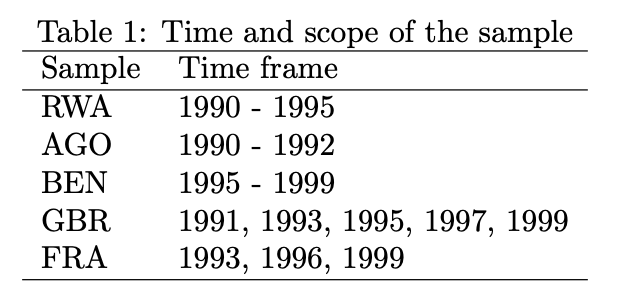

The default already provides a title (“Time and scope of the sample”)
that can be modified in the argument `title`. The same holds for the
column names (“Sample” and “Time frame” are set by default but can be
modified as shown below).

``` r

overview_latex(
  obj = output_table,
  id = "Countries",
  time = "Years",
  title = "Cool new title for our awesome table"
)
```

LaTeX output

    % Overview table generated in R version 4.0.0 (2020-04-24) using overviewR 
    % Table created on 2020-06-21
    \begin{table}[ht] 
     \centering 
     \caption{Cool new title for our awesome table} 
     \begin{tabular}{ll} 
     \hline 
    Countries & Years \\ 
    \hline 
     RWA & 1990 - 1995 \\ 
     AGO & 1990 - 1992 \\ 
     BEN & 1995 - 1999 \\ 
     GBR & 1991, 1993, 1995, 1997, 1999 \\ 
     FRA & 1993, 1996, 1999 \\ 
     \hline 
     \end{tabular} 
     \end{table} 

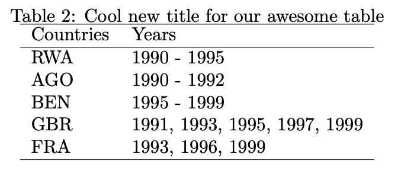

The same function can also be used for outputs from the
`overview_crosstab` function by using the argument `crosstab = TRUE`.
There are also options to label the respective conditions (`cond1` and
`cond2`). Note that this should correspond to the conditions (`cond1`
and `cond2`) specified in the `overview_crosstab` function.

``` r

overview_latex(
  obj = output_crosstab,
  title = "Cross table of the sample",
  crosstab = TRUE,
  cond1 = "GDP",
  cond2 = "Population"
)
```

LaTeX output

    % Overview table generated in R version 4.0.0 (2020-04-24) using overviewR 
    % Table created on 2020-06-21
    % Please add the following packages to your document preamble: 
    % \usepackage{multirow} 
    % \usepackage{tabularx} 
    % \newcolumntype{b}{X} 
    % \newcolumntype{s}{>{\hsize=.5\hsize}X} 
    \begin{table}[ht] 
    \caption{Cross table of the sample} 
     \begin{tabularx}{\textwidth}{ssbb} 
    \hline & & \multicolumn{2}{c}{\textbf{GDP}} \\ 
     & & \textbf{Fulfilled} & \textbf{Not fulfilled} \\ 
     \hline \\ 
     \multirow{2}{*}{\textbf{Population}} & \textbf{Fulfilled} & 
     AGO (1990, 1992), FRA (1993), GBR (1997) & BEN (1996, 1999), FRA (1999), GBR (1993), RWA (1992, 1994)\\  
     \\ \hline \\ 
     & \textbf{Not fulfilled} &  BEN (1997), RWA (1990) & AGO (1991), BEN (1995, 1998), FRA (1996), GBR (1991, 1995, 1999), RWA (1991, 1993, 1995)\\  \hline \\ 
     \end{tabularx} 
     \end{table} 

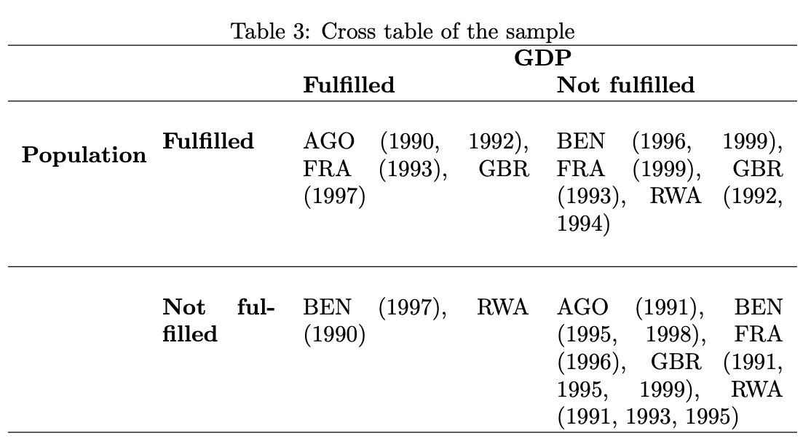

`overview_latex` further allows more specifications such as the font
size or a a label.

``` r

overview_latex(obj = output_table,
               fontsize = "scriptsize",
               label = "tab:overview")
```

With `save_out = TRUE` the function exports the output as a `.tex` file
and stores it on the device.

``` r

overview_latex(
  obj = output_table,
  save_out = TRUE,
  file_path = "SET-YOUR-PATH/output.tex"
)
```

### `overview_markdown`

`overview_markdown` mirrors the functionality of `overview_latex` but
produces Markdown output — useful for R Markdown documents, GitHub
READMEs, or any Markdown-based workflow.

``` r

overview_markdown(obj = output_table)
```

    ## Time and scope of the sample
    | Sample | Time frame |
    |--------|------------|
    | RWA | 1990 - 1995 |
    | AGO | 1990 - 1992 |
    | BEN | 1995 - 1999 |
    | GBR | 1991, 1993, 1995, 1997, 1999 |
    | FRA | 1993, 1996, 1999 |

The column headers can be customised with `id` and `time`, and the title
with `title`.

``` r

overview_markdown(
  obj = output_table,
  id = "Countries",
  time = "Years",
  title = "My custom title"
)
```

For cross-tab objects, set `crosstab = TRUE` and provide condition
labels:

``` r

overview_markdown(
  obj = output_crosstab,
  crosstab = TRUE,
  cond1 = "GDP",
  cond2 = "Population"
)
```

Use `save_out = TRUE` together with `file_path` to write the table
directly to a `.md` file:

``` r

overview_markdown(
  obj = output_table,
  save_out = TRUE,
  file_path = "output/overview.md"
)
```

## Visual overview

### `overview_plot`

In addition to tables, `overviewR` also provides plots to illustrate the
structure of your data. `overview_plot` illustrates the information that
is generated in `overview_table` in a ggplot graphic. All scope objects
(e.g., countries) are listed on the y-axis where horizontal lines
indicate the coverage across the entire time frame of the data (x-axis).
This helps to spot gaps in the data for specific scope objects and
outlines at what time point they occur.

``` r

data(toydata)
overview_plot(dat = toydata, id = ccode, time = year)
#> Warning: Using `size` aesthetic for lines was deprecated in ggplot2 3.4.0.
#> ℹ Please use `linewidth` instead.
#> ℹ The deprecated feature was likely used in the overviewR package.
#>   Please report the issue at <https://github.com/cosimameyer/overviewR/issues>.
#> This warning is displayed once per session.
#> Call `lifecycle::last_lifecycle_warnings()` to see where this warning was
#> generated.
```

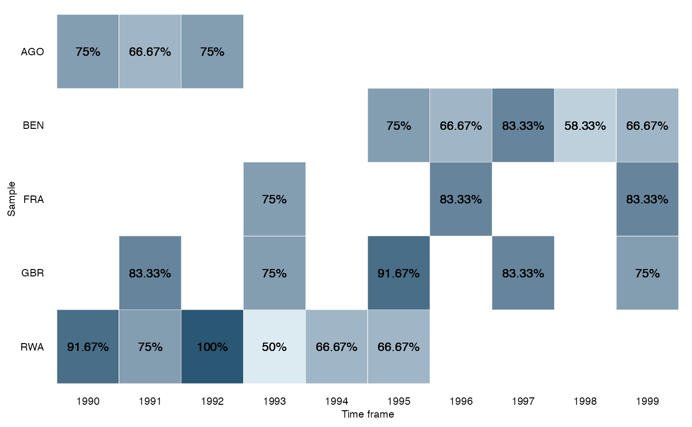

The results are sorted alphabetically by default. The order can also be
reversed by setting `asc` to `FALSE`.

``` r

overview_plot(
  dat = toydata,
  id = ccode,
  time = year,
  asc = FALSE
)
```

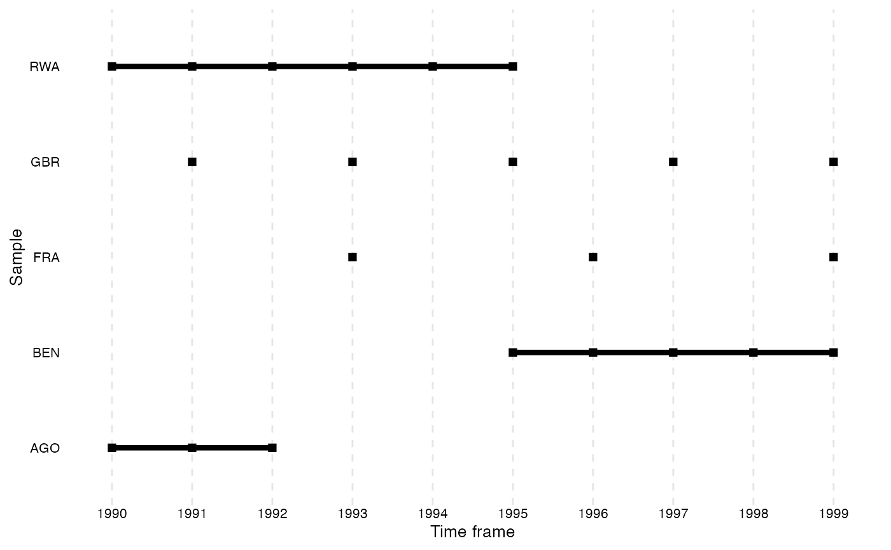

There is also an option to color the time lines conditionally. Here, we
introduce a dummy variable that indicates whether the year was before
1995 or not. We use this dummy to color the time lines using the `color`
argument.

``` r

library(overviewR) # Easily Extracting Information About Your Data
library(magrittr) # A Forward-Pipe Operator for R

# Code whether a year was before 1995
toydata <- toydata %>%
  dplyr::mutate(before = ifelse(year < 1995, 1, 0))

# Plot using the `color` argument
overview_plot(
  dat = toydata,
  id = ccode,
  time = year,
  color = before
)
```

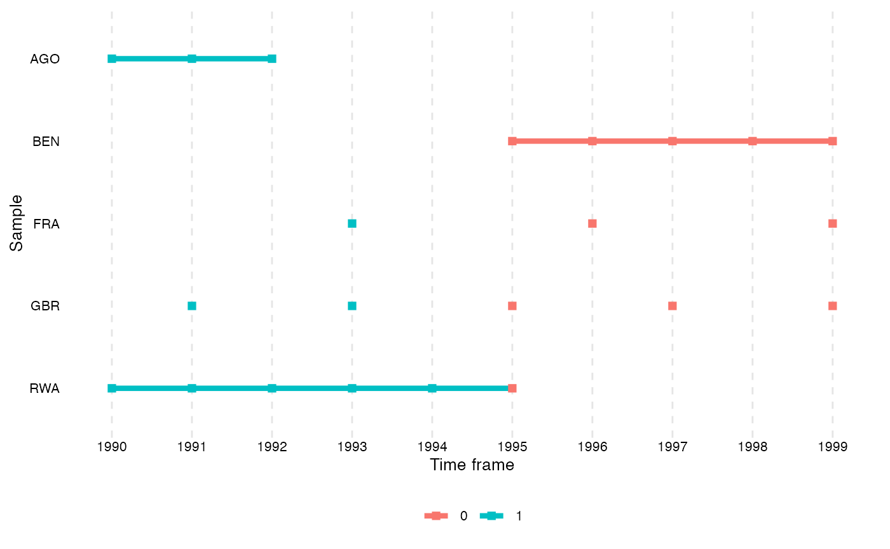

Since `overview_plot` returns a ggplot object, you can apply any ggplot2
color scale directly by adding a layer. This works for any number of
categories.

``` r

library(ggplot2)

# Explicit colors via scale_color_manual
overview_plot(
  dat = toydata,
  id = ccode,
  time = year,
  color = before
) +
  ggplot2::scale_color_manual(values = c("#E84646", "#4E84C4"))
```

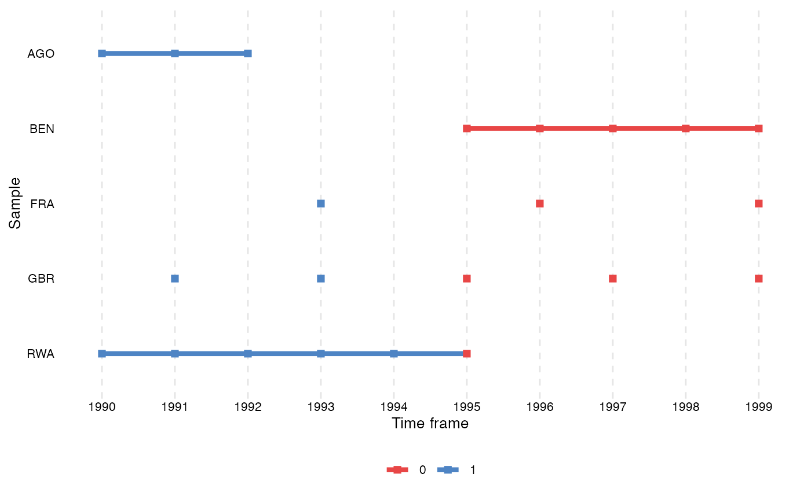

``` r

# RColorBrewer palette via scale_color_brewer
overview_plot(
  dat = toydata,
  id = ccode,
  time = year,
  color = before
) +
  ggplot2::scale_color_brewer(palette = "Set1")
```

The development version also allows to change the dot size using the
`dot_size` argument. The default is “2”.

``` r

# Plot using the `dot_size` argument
overview_plot(
  dat = toydata,
  id = ccode,
  time = year,
  dot_size = 5
)
```


### `overview_crossplot`

To visualize the cross table, `overview_crossplot` does the job. It
places each observation in one of four quadrants defined by `threshold1`
(x-axis) and `threshold2` (y-axis).

**Basic plot** — points only, no coloring or labels:

``` r

overview_crossplot(
  toydata,
  id = ccode,
  time = year,
  cond1 = gdp,
  cond2 = population,
  threshold1 = 25000,
  threshold2 = 27000
)
```

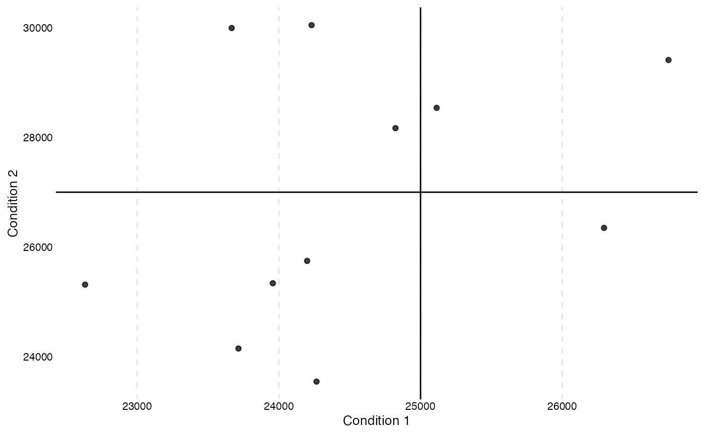

**With quadrant coloring** (`color = TRUE`) — each quadrant gets a
distinct color, making it easy to see how observations cluster:

``` r

overview_crossplot(
  toydata,
  id = ccode,
  time = year,
  cond1 = gdp,
  cond2 = population,
  threshold1 = 25000,
  threshold2 = 27000,
  color = TRUE
)
```


**With labels** (`label = TRUE`) — adds id–time labels to each point
using `ggrepel` to avoid overlaps:

``` r

overview_crossplot(
  toydata,
  id = ccode,
  time = year,
  cond1 = gdp,
  cond2 = population,
  threshold1 = 25000,
  threshold2 = 27000,
  label = TRUE
)
```

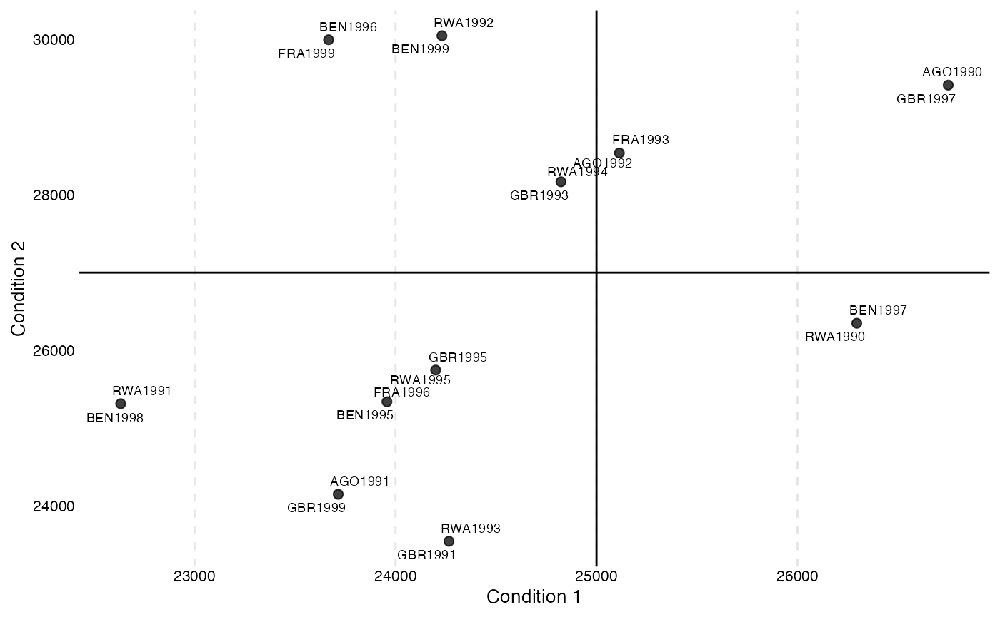

**With both coloring and labels** — the most informative variant:

``` r

overview_crossplot(
  toydata,
  id = ccode,
  time = year,
  cond1 = gdp,
  cond2 = population,
  threshold1 = 25000,
  threshold2 = 27000,
  color = TRUE,
  label = TRUE
)
```

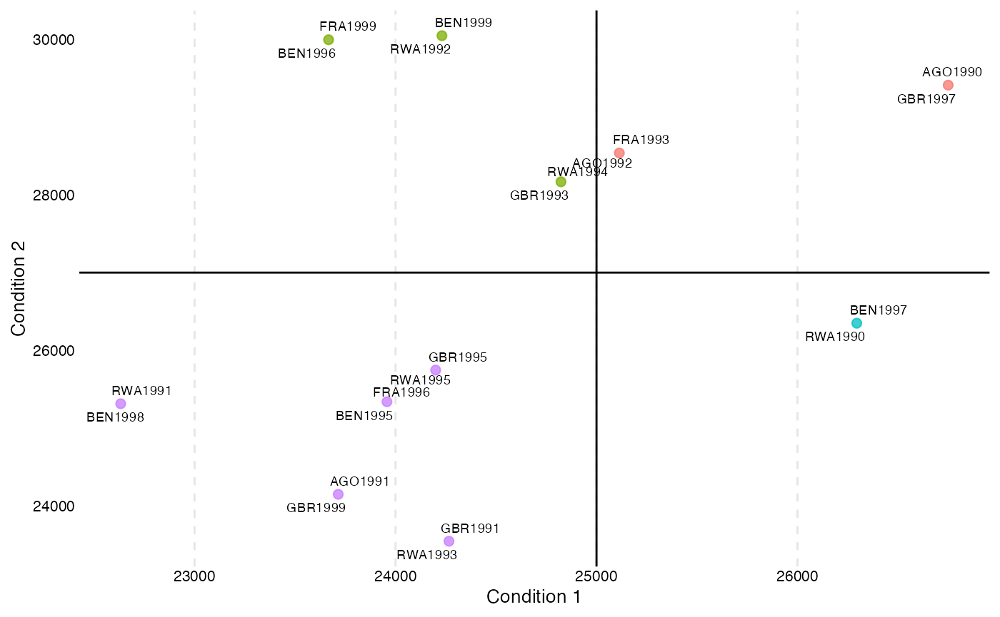

### `overview_heat`

`overview_heat` takes a closer look at the time and scope conditions by
visualizing the data coverage for each time and scope combination in a
ggplot heat map. This function is best explained using an example.
Suppose you have a dataset with monthly data for different countries and
want to know if data is available for each country in every month.
`overview_heat` intuitively does this by plotting a heat map where each
cell indicates the coverage for that specific combination of time and
scope (e,g., country-year). As illustrated below, the darker the cell
is, the more coverage it has. The plot also indicates the relative or
absolute coverage of each cell. For instance, Angola (“AGO”) in 1991
shows the coverage of 75%. This means that of all potential 12 months of
coverage (12 months for one year), only 9 are covered.

For this purpose, we first artificially reduced the `toydata`.

``` r

toydata_red <- toydata[-sample(seq_len(nrow(toydata)), 64), ]
```

``` r

overview_heat(toydata_red,
              ccode,
              year,
              perc = TRUE,
              exp_total = 12)
```

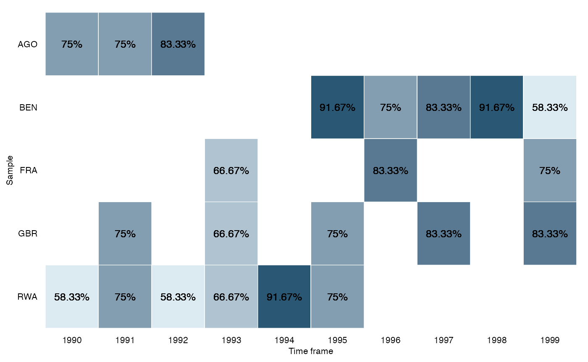

### `overview_na`

`overview_na` is a simple function that provides information about the
content of all variables in your data, not only the time and scope
conditions. It returns a horizontal ggplot bar plot that indicates the
amount of missing data (NAs) for each variable (on the y-axis). You can
choose whether to display the relative amount of NAs for each variable
in percentage (the default) or the total number of NAs.

For this purpose, we first artificially reduced our `toydata`.

``` r

toydata_with_na <- toydata %>%
  dplyr::mutate(
    year = ifelse(year < 1992, NA, year),
    month = ifelse(month %in% c("Jan", "Jun", "Aug"), NA, month),
    gdp = ifelse(gdp < 20000, NA, gdp)
  )
```

``` r

overview_na(toydata_with_na)
#> Warning in overview_na(toydata_with_na): Missing values detected in
#> time-related column(s): month. Consider using `row_wise = TRUE` or inspecting
#> these columns before drawing conclusions about time coverage.
```

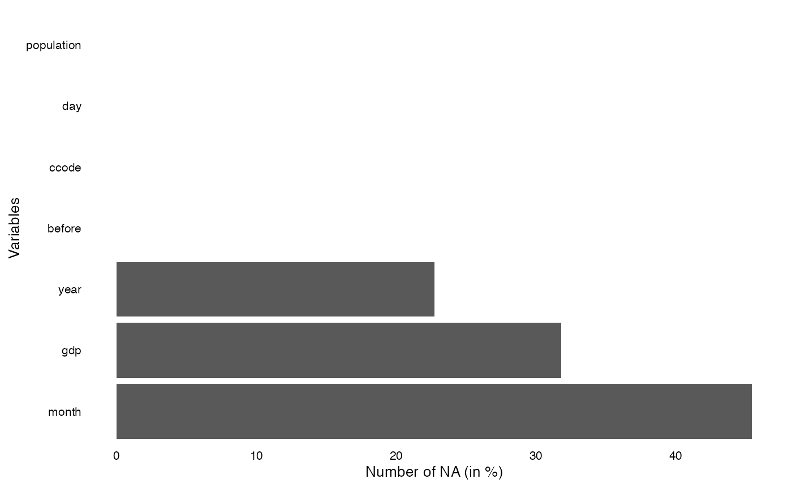

``` r

overview_na(toydata_with_na, perc = FALSE)
#> Warning in overview_na(toydata_with_na, perc = FALSE): Missing values detected
#> in time-related column(s): month. Consider using `row_wise = TRUE` or
#> inspecting these columns before drawing conclusions about time coverage.
```

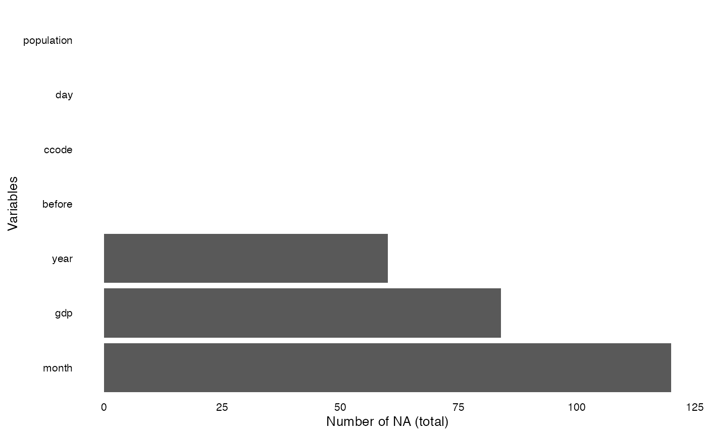

#### Row-wise NA overview

By default, `overview_na` summarises NAs *column-wise* (one bar per
variable). Setting `row_wise = TRUE` switches to a *row-wise*
perspective: each observation on the y-axis, NA count on the x-axis.
This is useful to spot rows that are largely empty.

``` r

overview_na(toydata_with_na, row_wise = TRUE)
```


``` r

overview_na(toydata_with_na, row_wise = TRUE, perc = FALSE)
```

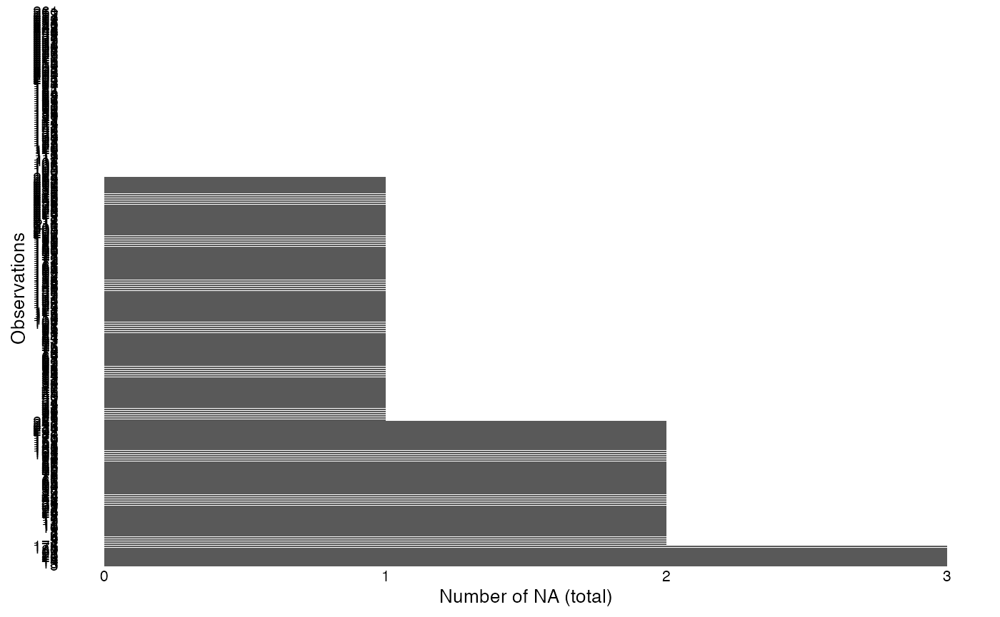

You can also append the row-wise NA count and percentage directly to
your original data frame with `add = TRUE`. This returns a data frame
rather than a plot.

``` r

toydata_extended <- overview_na(toydata_with_na, row_wise = TRUE, add = TRUE)
head(toydata_extended)
```

### `overview_overlap`

This function allows to compare two data sets. We are currently working
on an extended version that allows comparing \>2 data sets.

At the current development stage, the function works as follows:

``` r

library(dplyr)

# Subset one data set for comparison
toydata2 <- toydata %>% dplyr::filter(year > 1992)

overview_overlap(
  dat1 = toydata,
  dat2 = toydata2,
  dat1_id = ccode,
  dat2_id = ccode,
  plot_type = "bar" # This is the default
)
#> Joining with `by = join_by(ccode)`
#> Warning: Removed 1 row containing missing values or values outside the scale range
#> (`geom_bar()`).
```

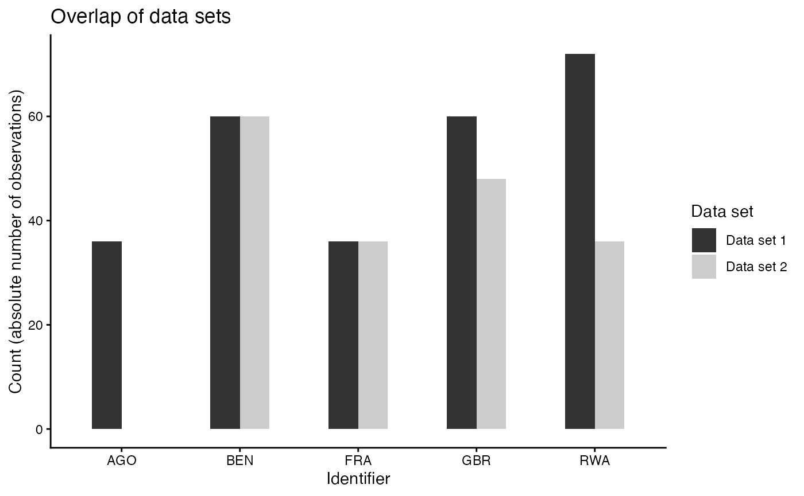

Or a Venn diagram

``` r_venn
overview_overlap(
  dat1 = toydata,
  dat2 = toydata2,
  dat1_id = ccode,
  dat2_id = ccode,
  plot_type = "venn"
)
```

### Customizing plots: `ggplot2`

The plot functions are fully `ggplot2` based. While a theme is
pre-defined, this can easily be overwritten.

A classical `ggplot2` theme alternative

``` r

library(ggplot2) # Create Elegant Data Visualisations 
                 # Using the Grammar of Graphics

overview_na(toydata_with_na) +
  ggplot2::theme_minimal()
#> Warning in overview_na(toydata_with_na): Missing values detected in
#> time-related column(s): month. Consider using `row_wise = TRUE` or inspecting
#> these columns before drawing conclusions about time coverage.
```


## Compatibilities with other packages

### Workflow: `tidyverse`

All functions are further easily accessible using a common `tidyverse`
workflow. Here are just three examples – the possibilities are endless.

Using a filter function

``` r

library(dplyr) # A Grammar of Data Manipulation # A Grammar of Data Manipulation

toydata_with_na %>%
  dplyr::filter(year > 1993) %>%
  overview_na()
#> Warning in overview_na(.): Missing values detected in time-related column(s):
#> month. Consider using `row_wise = TRUE` or inspecting these columns before
#> drawing conclusions about time coverage.
```

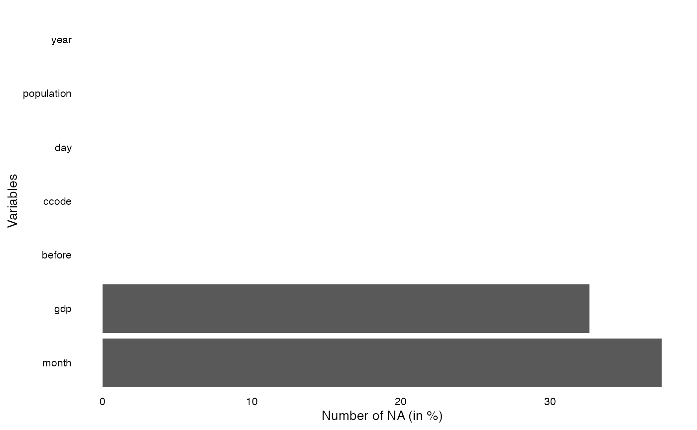

Using mutate to generate meaningful country names

``` r

library(countrycode) # Convert Country Names and Country Codes
library(dplyr) # A Grammar of Data Manipulation # A Grammar of Data Manipulation

toydata %>%
  # Transform the country code (ISO3 character code) into a country name using
  # the `countrycode` package
  dplyr::mutate(country =
                  countrycode::countrycode(ccode, "iso3c", "country.name")) %>%
  overview_plot(id = country, time = year)
```


Using different `overviewR` functions after each other to generate a
workflow

``` r

# Produces a printable LaTeX output
toydata %>%
  overview_tab(id = ccode, time = year) %>%
  overview_latex()
```

    % Overview table generated in R version 4.0.2 (2020-06-22) using overviewR 
    % Table created on 2020-12-30
    \begin{table}[ht] 
     \centering 
     \caption{Time and scope of the sample} 
    \label{tab:tab1} 

    \begin{tabular}{ll} 
     \hline 
    Sample & Time frame \\ 
    \hline 
     AGO & 1990 - 1992 \\ 
     BEN & 1995 - 1999 \\ 
     FRA & 1993, 1996, 1999 \\ 
     GBR & 1991, 1993, 1995, 1997, 1999 \\ 
     RWA & 1990 - 1995 \\ 
     \hline 
     \end{tabular} 
     \end{table} 

### Presenting tables: `flextable`, `xtable`, and `kable`

The outputs of `overview_tab` and `overview_crosstab` are also
compatible with other functions such as
[`xtable`](https://CRAN.R-project.org/package=xtable),
[`flextable`](https://CRAN.R-project.org/package=flextable), or
[`kable`](https://yihui.org/rmarkdown-cookbook/kable.html) from
[`knitr`](https://yihui.org/knitr/).

Two examples are shown below:

``` r

library(flextable) # not installed on this machine
table_output <- qflextable(output_table)
table_output <-
  set_header_labels(table_output,
                    ccode = "Countries",
                    time_frame = "Time frame")
set_table_properties(table_output,
                     width = .4,
                     layout = "autofit")
```

``` r

library(knitr) # A General-Purpose Package for Dynamic Report Generation in R
knitr::kable(output_table)
```

| ccode | time_frame                   |
|:------|:-----------------------------|
| RWA   | 1990-1995                    |
| AGO   | 1990-1992                    |
| BEN   | 1995-1999                    |
| GBR   | 1991, 1993, 1995, 1997, 1999 |
| FRA   | 1993, 1996, 1999             |

A classical `ggplot2` theme alternative

``` r

library(ggplot2) # Create Elegant Data Visualisations Using the
# Grammar of Graphics

overview_na(toydata_with_na) +
  ggplot2::theme_minimal()
#> Warning in overview_na(toydata_with_na): Missing values detected in
#> time-related column(s): month. Consider using `row_wise = TRUE` or inspecting
#> these columns before drawing conclusions about time coverage.
```

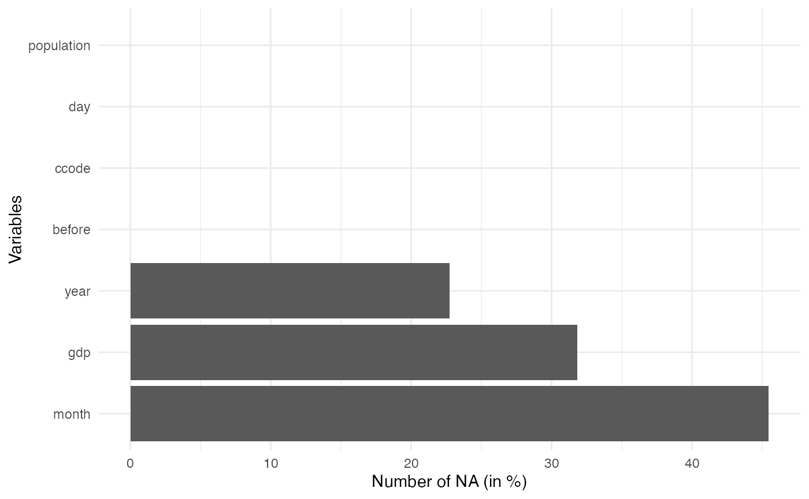

### Extensions

If you wish to compare two data sets using `overview_tab`, this is not
(yet) implemented in `overviewR` but there is currently a workaround.

``` r

library(overviewR)
library(dplyr)
library(xtable)

# Load data
data(toydata)

# Restrict the data so that we have something to compare :-)
toydata_res <- toydata %>%
  dplyr::filter(year > 1992)

# Generate two overview_tab objects
dat1 <- overview_tab(toydata, id = ccode, time = year)
dat2 <- overview_tab(toydata_res, id = ccode, time = year)

# And now we use full_join to combine both
dat_full <- dat1 %>%
  dplyr::full_join(dat2, by = "ccode") %>%
  dplyr::rename(time_dat1 = time_frame.x,
                time_dat2 = time_frame.y)
```

Having a look at the output, we see that this is exactly what we wanted
to have:

``` r

head(dat_full)
```

    #> # A tibble: 5 x 3
    #> # Groups:   ccode [5]
    #>   ccode time_dat1                    time_dat2             
    #>   <chr> <chr>                        <chr>                 
    #> 1 AGO   1990 - 1992                  <NA>                  
    #> 2 BEN   1995 - 1999                  1995 - 1999           
    #> 3 FRA   1993, 1996, 1999             1993, 1996, 1999      
    #> 4 GBR   1991, 1993, 1995, 1997, 1999 1993, 1995, 1997, 1999
    #> 5 RWA   1990 - 1995                  1993 - 1995

`overview_latex` cannot handle this object (yet), so we use `xtable`
instead which gives us the LaTeX output.

``` r

print(xtable(dat_full), include.rownames = FALSE)
```

    % latex table generated in R 4.0.2 by xtable 1.8-4 package
    % Tue Feb 16 18:20:51 2021
    \begin{table}[ht]
    \centering
    \begin{tabular}{lll}
      \hline
    ccode & time\_dat1 & time\_dat2 \\ 
      \hline
    AGO & 1990 - 1992 &  \\ 
      BEN & 1995 - 1999 & 1995 - 1999 \\ 
      FRA & 1993, 1996, 1999 & 1993, 1996, 1999 \\ 
      GBR & 1991, 1993, 1995, 1997, 1999 & 1993, 1995, 1997, 1999 \\ 
      RWA & 1990 - 1995 & 1993 - 1995 \\ 
       \hline
    \end{tabular}
    \end{table}

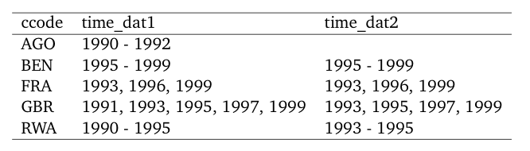
