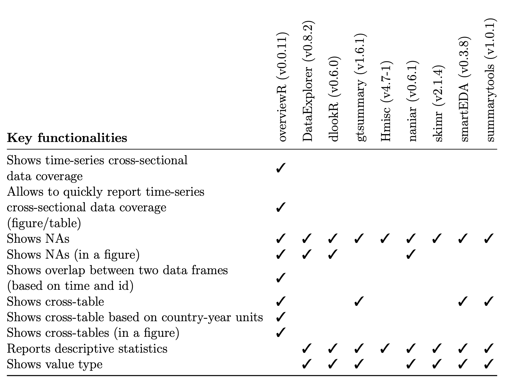
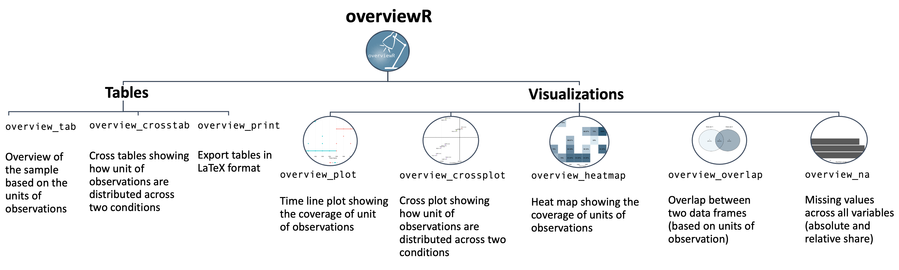

    
# Summary

The package overviewR [@cosima_meyer_2022_6481394] helps users to get an overview of data with a particular emphasis on the extent that the distinct units of observation are covered for the entire time frame of the data set. With (large) data sets that have many different observations over a long period, it becomes increasingly difficult to identify each unique observation and its exact coverage in the data. In particular, if some observations are not included for the entire time span of the data – either because they entered later, dropped out earlier, or have gaps in between – it can become difficult to spot potential problems in the data’s time and scope. As @staniak2019landscape argue, these tools are increasingly in demand.

The main advantages of overviewR are threefold: 1) it allows users to quickly understand the data and the distribution of the observations over time, 2) it offers several helper functions that facilitate complex variable engineering tasks such as the merging of multiple data frames on different time formats or the generation of specific time periods, and 3) it allows to show this information both in a visual and tabular form that is convenient for academic publications.


# Statement of need

overviewR has already been used in the data wrangling process as well as to generate an illustrative overview of the sample in various academic publications and research [@hammerschmidt2021moving; @hammerschmidt2021foreign; @meyer2022power; @meyer2021power]. While not limited to these applications, we see its main advantage for researchers and practitioners working with time-series cross-sectional data and its power to illustratively visualize key information of the data. When comparing with other exploratory data analysis packages available (for instance DataExplorer [@dataexplorer2020], gtsummary [@gtsummary2022], dlookR [@ryu2021dlookr], Hmisc [@hmisc2022], naniar [@naniar2021], smartEDA [@putatunda2019smarteda], skimr [@skimr2022], or summarytools [@comtois2022package]), we do not see the key functions of overviewR fully covered. A detailed comparison that contrasts the core functionalities and advantages of overviewR is outlined in  Figure \ref{overview} below.




# Key functions

overviewR can be used by everyone who works with data that have time-and-scope characteristics. To get a quick overview of which units (i.e. countries, companies, test persons, etc.) are present or missing during a given time span (i.e. years, months, days, minutes, etc.), overviewR provides an easy and intuitive insight into the set-up of your data. But overviewR goes beyond this: It also allows users to investigate logical clusters of time-unit observations by using cross tables (or cross plots for visualization). It further allows the user to investigate the overlap between two data sets as well as the distribution of missing values across the data. overviewR relies on `ggplot2` [@ggplot2022] and  `ggvenn` [@ggvenn2021]  for visualization. It comes with example data containing a simple time-series cross-sectional data set. All functions work with `data.frame` objects while `overview_tab` and `overview_na` can also handle `data.table` objects to increase the performance.



As Figure \ref{comparison} shows, the key functions of overviewR can be divided into its type of presentation (tabular or visual). They may, however, also be categorized along their functionalities: 1) a general overview of the units of observation (`overview_tab`, `overview_plot`, `overview_heatmap`), 2) a logical cluster within the data (`overview_crosstab`, `overview_crossplot`), 3) key information about the data sets (`overview_overlap`, `overview_na`), and 4) export functions (`overview_latex`).

# Visualization of a workflow
To visualize a typical workflow, we rely on the internal data provided by overviewR.


```r
data(toydata)
head(toydata)
```

```
#   ccode year month      gdp population day
# 1   RWA 1990   Jan 24180.77  14969.988   1
# 2   RWA 1990   Jan 23650.53  11791.464   2
# 3   RWA 1990   Jan 21860.14  30047.979   3
# 4   RWA 1990   Jan 20801.06  19853.556   4
# 5   RWA 1990   Jan 18702.84   5148.118   5
# 6   RWA 1990   Jan 30272.37  48625.140   6
```

There are 264 observations for 5 countries (Angola, Benin, France, Rwanda, and UK) stored in the`ccode`variable, over a time period between 1990 to 1999 (`year`) with additional information for the month (`month`). Additionally, two artificially generated fake variables for the gross domestic product (GDP, `gdp`) and population size (`population`) are included to illustrate conditions.

We can now use `countrycode` [@countrycode2022] as well as `dplyr` [@dplyr2022] to transform the `ccode` into more meaningful information and plot a visualization using `overview_plot`:


```r
toydata %>%
  # Transform the country code (ISO3 character code) into 
  # a country name using the `countrycode` package
  dplyr::mutate(country =
                  countrycode::countrycode(ccode, "iso3c", 
                                           "country.name")) %>%
  overview_plot(id = country, time = year)
```

The plot shows the sample distribution of all countries in the sample and illustrates at which year data is (consecutively) available and when years are missing (see Figure \ref{overviewplot}).

\begin{figure}[htpb!]
  \includegraphics{figures/overview_plot.png}
  \caption{Visualization of `overview\_plot`}
  \label{overviewplot}
\end{figure}

Going further, we can then also rely on `overview_heat` to identify the coverage of each month per country-year observation. 


```r
overview_heat(toydata_red,
              ccode,
              year,
              perc = TRUE,
              exp_total = 12)
```

\begin{figure}[htpb!]
  \includegraphics{figures/overview_heat.png}
  \caption{Visualization of `overview\_heat`}
  \label{overviewheat}
\end{figure}

Taking a twelve-month coverage as the baseline (with `exp_total`), we see in Figure \ref{overviewheat} that only Benin (`BEN`) in 1997 achieves full coverage. With this function, researchers can also analyze the coverage of panel (survey) data.

If we wanted to compare meaningful clusters within the sample, we can rely on `overview_crossplot`. Similar to a tabular cross table (as presented in function `overview_crosstab`), this function visualizes the units of observations in the package across two conditions. The user can define and set the conditions as well as the thresholds as shown in the following example. 


```r
overview_crossplot(
  toydata, 
  id = ccode,
  time = year,
  cond1 = gdp,
  cond2 = population,
  threshold1 = 25000,
  threshold2 = 27000,
  color = TRUE,
  label = TRUE
)
```

Figure \ref{overviewcrossplot} shows where the units of observations (country-year) are located across both conditions (`gdp` and `population`). 

\begin{figure}[htpb!]
  \includegraphics{figures/overview_crossplot.png}
  \caption{Visualization of `overview\_crossplot`}
  \label{overviewcrossplot}
\end{figure}

In a next step, the user may want to compare two data sets. For this, we artificially reducing the internal data set to allow a comparison. 


```r
# Subset one data set for comparison
toydata2 <- toydata %>% dplyr::filter(year > 1992)

overview_overlap(
  dat1 = toydata,
  dat2 = toydata2,
  dat1_id = ccode,
  dat2_id = ccode,
  plot_type = "bar" # This is the default
)
```

Figure \ref{overviewoverlap} shows that there are less observations for Rwanda (`RWA`) and the United Kingdom (`GBR`) in `toydata2` – which is true since we subset this data set and only kept observations for 1992 and newer.

\begin{figure}[htpb!]
  \includegraphics{figures/overview_overlap.png}
  \caption{Visualization of `overview\_overlap`}
  \label{overviewoverlap}
\end{figure}

# Availability

overviewR is available on [CRAN](https://cran.rstudio.com/web/packages/overviewR/index.html) and the development version is available on [Github](https://github.com/cosimameyer/overviewR). We also provide a [cheatsheet](https://github.com/rstudio/cheatsheets/blob/main/overviewR.pdf) to quickly get an idea of its key functionalities and describe possible workflows on the [package website](https://cosimameyer.github.io/overviewR/).
 
# Acknowledgements
We would like to thank the excellent R community that enabled the creation of overviewR by providing free resources on package development.

# References
